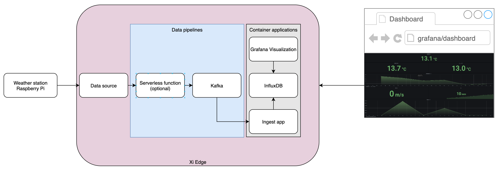
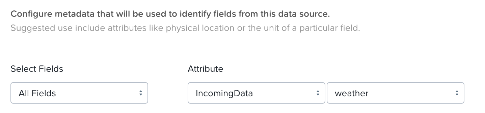
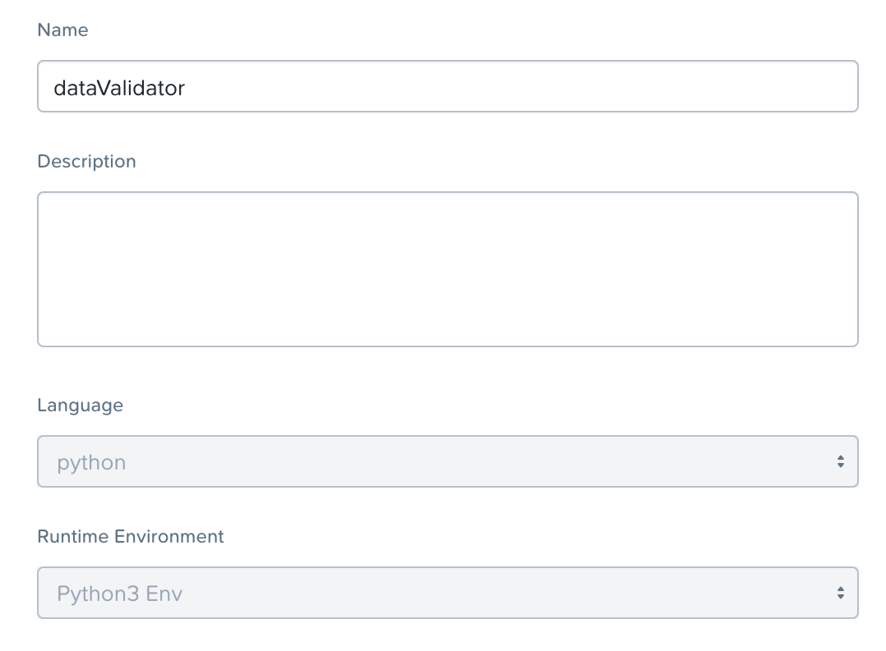
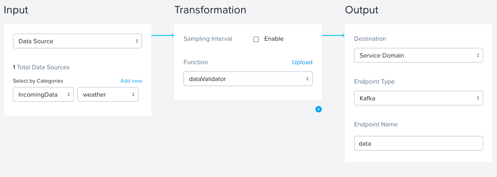
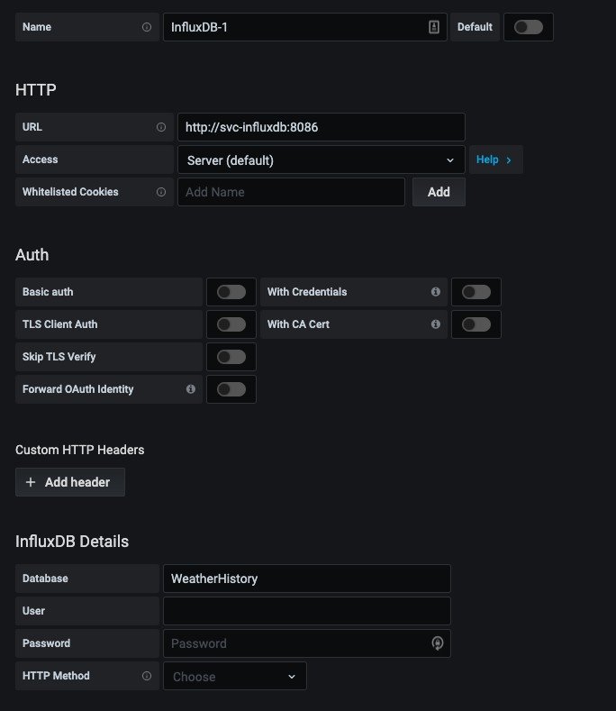

# Xi IoT Weather station

## Overview

This solution ingests weather data from an weather station based on Raspberry Pi. Data is ingested using MQTT, the incoming weather data is then validated using a serverless function written in python. Data is then sent to a Kafka topic using the Xi IoT Data Pipeline. Three containerized applications are then deployed to consume data from Kafka, input the data to Influx DB and graphed using Grafana.



## Step by step guide

Simple step by step guide for setting up the Xi IoT Weather station using Xi IoT Portal.

## Step 1 - Create a project

Sign in to the Xi IoT Portal. Open the ```Projects``` section in the menu on the left. Click on ```Create```.
Give your project a name and assign a user.  
Click ```Next```. Assign a service domain using ```Add service domain```.  
Click ```Next```. Enable services for our project.  
This project is making use of

* Kubernetes Apps
* Functions and Data Pipelines
* Ingress Controller - Traefik
* Data Streaming - Kafka, NATS

Click on ```Create```. 

## Step 2 - Setup data source

Next we add a new data source. This is where the data enters the Xi IoT solution.
We will create a new category for our incoming data.
Open the ```Categories``` section in the menu and click ```Create```. Give the new category a name and click on ```Add value```. In my example I use ```IncommingData``` as name and add a value of ```weather```


Once we have our category setup we can add the data source.

Open the ```Data sources and IoT sensors``` section of the menu. Click on ```Add Data source```.  
Select ```sensor```, Give the data source a Name, a associated Service domain, select ```MQTT```as protocol.
Click ```Generate Certificates``` to generate .X509 certificates for device authentication. Download the certificates before clicking ```Next```. In the next step, add the MQTT Topic your Weather stations publishes it's data on.


In my example my weather station publishes on the MQTT topic ```weather\data```.

Click on ```Next```. Assign the incoming data to the category we created earlier in this step.



Click on ```Create```.

## Step 3 - Create function

Select the project we created in step 1 from the drop-down at the top of the menu on the left.
Open the ```Functions and Data Pipelines``` section in the menu. Switch to the ```Functions``` tab and click ```Create```. Give your function a name and a description. Select language and runtime environment.
In my example Im using Python and the built in Python3 Env runtime environment.



Click on ```Next```.  
The function I am using is simply outputting the incoming data to the service domain log before sending the data forwards in the data pipeline. Upload your function or copy and paste.

```python
#!/usr/bin/python
import logging
import json

'''
Example payload
    {
    'measurement' : 'temperature',
    'value' : '23.3'
    }
'''
def main(ctx,msg):
    payload = json.loads(msg)
    logging.info("***** Validating *****")
    if(payload['measurement'] == "temperature"):
        logging.info("Temperature is: " + payload["value"])
    elif(payload['measurement'] == "rain"):
        logging.info("Rain is: " + payload["value"])
    elif(payload['measurement'] == "wind"):
        logging.info("Wind is: " + payload["value"])
    else:
        logging.info("Unknown measurement")                  
    
    return ctx.send(str.encode(json.dumps(payload)))

```

Click on ```Create``` down in the right corner.

## Step 4 - Create a Data pipeline

Next step is to connect our data source to our function using a ```Data pipeline```.
Click on ```Functions and Data Pipelines``` in the menu and select the ```Data Pipelines``` tab.  
Click on ``` Create```

Give the Data pipeline a Name  
Under ```Input``` select ```Data source``` and then ```IncommingData``` and ```weather``` category from step 2.  
Under ```Transformation``` select our function from step 3.
Under ```Output``` select ```Publish to service domain```,  
select ```Kafka``` as Endpoint type and enter ```data``` as Endpoint Name.


Click on ```Create``` down in the right corner.

## Step 5 - Deploy Kubernetes Application

The next and final step is to deploy the kubernetes applications.
Select ```Kubernetes Apps``` from the menu. Click on ```Create```.

Enter a name for our application.  
Select your Service Domain.
Click on ```Next``` down in the right corner.

In my example I am deploying 3 containers.

* Kafka consumer
* Influx DB
* Grafana

#### Kafak consumer

This is a simple python application that consumes data from the Kafka service and inputs the data to the influx data base. It is available as an image (voxic/xektia) on dockerhub.  

Source:
``` python
import os
from kafka import KafkaConsumer
from influxdb import InfluxDBClient
import json

KAFKA_TOPIC = os.environ.get('KAFKA_TOPIC') or print("KAFKA_TOPIC Not defined") 
KAFKA_SERVER = os.environ.get('KAFKA_SERVER') or print("KAFKA_SERVER Not defined")
INFLUXDB_SERVER = os.environ.get('INFLUXDB_SERVER') or print("INFLUXDB_SERVER Not defined")
print("KAFKA_TOPIC " + KAFKA_TOPIC)
print("KAFKA_SERVER " + KAFKA_SERVER)
print("INFLUXDB_SERVER" + INFLUXDB_SERVER)

client = InfluxDBClient(host=INFLUXDB_SERVER, port=8086)

if 'WeatherHistory' in str(client.get_list_database()):
    client.switch_database('WeatherHistory')
else:
    client.create_database('WeatherHistory')
    client.switch_database('WeatherHistory')

consumer = KafkaConsumer(
    KAFKA_TOPIC, 
    bootstrap_servers=KAFKA_SERVER,
    auto_offset_reset='earliest',
    enable_auto_commit=True,
    group_id='simple-consumers')

for msg in consumer:
    print (msg)
    data = json.loads(msg.value)
    value = [
        {"measurement":"weather",
            "tags": {
                        "Area": "Sweden",
                        "Location": "Tullinge"
                    },
            "fields":
            {
                    str(data['measurement']): float(data['value'])
            }       
        }
    ]
    client.write_points(value)
    print("Data written to DB")
```

#### Influx DB

Influx DB is an open source time series database. More info at https://www.influxdata.com/

#### Grafana

Grafana is an open source tool for building dashboards. More info at https://grafana.com/

___
To deploy our applications paste the following deployment configuration:
```yaml
---
kind: PersistentVolumeClaim
apiVersion: v1
metadata:
  name: task-influx-claim
spec:
  accessModes:
    - ReadWriteOnce
  resources:
    requests:
      storage: 3Gi
---
kind: Deployment
apiVersion: apps/v1
metadata:
  name: influxdb
spec:
  replicas: 1
  selector:
    matchLabels:
      app: influxdb
  template:
    metadata:
      labels:
        app: influxdb
    spec:
      volumes:
        - name: var-lib-influxdb
          persistentVolumeClaim:
            claimName: task-influx-claim
      containers:
        - name: influxdb
          image: 'docker.io/influxdb:1.6.4'
          imagePullPolicy: IfNotPresent
          ports:
            - containerPort: 8086
          volumeMounts:
            - mountPath: /var/lib/influxdb
              name: var-lib-influxdb
---
apiVersion: v1
kind: Service
metadata:
  name: svc-influxdb
  labels:
    app: influxdb
spec:
  type: NodePort
  ports:
    - port: 8086
  selector:
    app: influxdb
---
kind: PersistentVolumeClaim
apiVersion: v1
metadata:
  name: task-grafana-claim
spec:
  accessModes:
    - ReadWriteOnce
  resources:
    requests:
      storage: 3Gi
---
kind: Deployment
apiVersion: apps/v1
metadata:
  name: grafana
spec:
  replicas: 1
  selector:
    matchLabels:
      app: grafana
  template:
    metadata:
      labels:
        app: grafana
    spec:
      volumes:
        - name: var-lib-grafana
          persistentVolumeClaim:
            claimName: task-grafana-claim    
      containers:
        - name: grafana
          image: grafana/grafana
          imagePullPolicy: IfNotPresent
          ports:
            - name: web
              containerPort: 3000
          volumeMounts:
            - mountPath: /var/lib/grafana
              name: var-lib-grafana
---
apiVersion: v1
kind: Service
metadata:
  name: svc-grafana
  annotations:
    sherlock.nutanix.com/http-ingress-path: /
spec:
  ports:
    - protocol: TCP
      name: web
      port: 3000
  selector:
    app: grafana
---
kind: Deployment
apiVersion: apps/v1
metadata:
  name: xi-kafka-influx
spec:
  replicas: 1
  selector:
    matchLabels:
      app: xi-kafka-influx
  template:
    metadata:
      labels:
        app: xi-kafka-influx
    spec:
      containers:
        - name: xi-kafka-influx
          image: voxic/xektia
          imagePullPolicy: Always
          env:
            - name: KAFKA_SERVER
              value: '{{.Services.Kafka.Endpoint}}'
            - name: KAFKA_TOPIC
              value: weather-data
            - name: INFLUXDB_SERVER
              value: svc-influxdb    
```

Click on ```Next``` down in the right corner. We don't need any outputs so click on ```Create``` down in the right corner.  
This deployment creates two persistent volume claims, one for Influx DB and one for Grafana for data persistency. It also makes use of the built in Ingress controller to publish the Grafana user interface.

We have now finished the setup of Xi IoT Weather Station.

## Accessing Grafana

To access the Grafana user interface open your browser and typ in the ip to your service domain (```https://ip-to-servicedomain/```).
Default username _and_ password for Grafana is ```admin```

#### Configuring Grafana data source (connecting Grafana to InfluxDB)

In Grafana click on the cogs icon in the menu on the left. Click on ```Data Sources```.  
Click ```Add Data Source```.
Fill in settings:



Click on ```Save and Test```.

Once the data source is connected you can import this template Dashboard using the ```+``` in the left menu to import JSON.

```json
{
  "annotations": {
    "list": [
      {
        "builtIn": 1,
        "datasource": "-- Grafana --",
        "enable": true,
        "hide": true,
        "iconColor": "rgba(0, 211, 255, 1)",
        "name": "Annotations & Alerts",
        "type": "dashboard"
      }
    ]
  },
  "editable": true,
  "gnetId": null,
  "graphTooltip": 0,
  "id": 1,
  "links": [],
  "panels": [
    {
      "datasource": null,
      "fieldConfig": {
        "defaults": {
          "custom": {},
          "decimals": 1,
          "mappings": [],
          "thresholds": {
            "mode": "absolute",
            "steps": [
              {
                "color": "green",
                "value": null
              },
              {
                "color": "red",
                "value": 80
              }
            ]
          },
          "unit": "celsius"
        },
        "overrides": []
      },
      "gridPos": {
        "h": 7,
        "w": 24,
        "x": 0,
        "y": 0
      },
      "id": 4,
      "options": {
        "colorMode": "value",
        "graphMode": "none",
        "justifyMode": "auto",
        "orientation": "auto",
        "reduceOptions": {
          "calcs": [
            "last"
          ],
          "fields": "",
          "values": false
        }
      },
      "pluginVersion": "7.0.4",
      "targets": [
        {
          "groupBy": [],
          "measurement": "weather",
          "orderByTime": "ASC",
          "policy": "default",
          "refId": "A",
          "resultFormat": "time_series",
          "select": [
            [
              {
                "params": [
                  "temperature"
                ],
                "type": "field"
              }
            ]
          ],
          "tags": []
        }
      ],
      "timeFrom": null,
      "timeShift": null,
      "title": "Temperature Now",
      "type": "stat"
    },
    {
      "datasource": null,
      "fieldConfig": {
        "defaults": {
          "custom": {},
          "decimals": 1,
          "mappings": [],
          "thresholds": {
            "mode": "absolute",
            "steps": [
              {
                "color": "green",
                "value": null
              },
              {
                "color": "red",
                "value": 80
              }
            ]
          },
          "unit": "celsius"
        },
        "overrides": []
      },
      "gridPos": {
        "h": 8,
        "w": 12,
        "x": 0,
        "y": 7
      },
      "id": 6,
      "options": {
        "colorMode": "value",
        "graphMode": "none",
        "justifyMode": "auto",
        "orientation": "auto",
        "reduceOptions": {
          "calcs": [
            "max"
          ],
          "fields": "",
          "values": false
        }
      },
      "pluginVersion": "7.0.4",
      "targets": [
        {
          "groupBy": [],
          "measurement": "weather",
          "orderByTime": "ASC",
          "policy": "default",
          "refId": "A",
          "resultFormat": "time_series",
          "select": [
            [
              {
                "params": [
                  "temperature"
                ],
                "type": "field"
              }
            ]
          ],
          "tags": []
        }
      ],
      "timeFrom": null,
      "timeShift": null,
      "title": "Temperature Max",
      "type": "stat"
    },
    {
      "datasource": null,
      "fieldConfig": {
        "defaults": {
          "custom": {},
          "decimals": 1,
          "mappings": [],
          "thresholds": {
            "mode": "absolute",
            "steps": [
              {
                "color": "green",
                "value": null
              },
              {
                "color": "red",
                "value": 80
              }
            ]
          },
          "unit": "celsius"
        },
        "overrides": []
      },
      "gridPos": {
        "h": 8,
        "w": 12,
        "x": 12,
        "y": 7
      },
      "id": 5,
      "options": {
        "colorMode": "value",
        "graphMode": "none",
        "justifyMode": "auto",
        "orientation": "auto",
        "reduceOptions": {
          "calcs": [
            "min"
          ],
          "fields": "",
          "values": false
        }
      },
      "pluginVersion": "7.0.4",
      "targets": [
        {
          "groupBy": [],
          "measurement": "weather",
          "orderByTime": "ASC",
          "policy": "default",
          "refId": "A",
          "resultFormat": "time_series",
          "select": [
            [
              {
                "params": [
                  "temperature"
                ],
                "type": "field"
              }
            ]
          ],
          "tags": []
        }
      ],
      "timeFrom": null,
      "timeShift": null,
      "title": "Temperature Min",
      "type": "stat"
    },
    {
      "aliasColors": {},
      "bars": false,
      "dashLength": 10,
      "dashes": false,
      "datasource": null,
      "decimals": 1,
      "fieldConfig": {
        "defaults": {
          "custom": {}
        },
        "overrides": []
      },
      "fill": 3,
      "fillGradient": 6,
      "gridPos": {
        "h": 11,
        "w": 24,
        "x": 0,
        "y": 15
      },
      "hiddenSeries": false,
      "id": 2,
      "legend": {
        "avg": true,
        "current": false,
        "max": true,
        "min": true,
        "show": true,
        "total": false,
        "values": true
      },
      "lines": true,
      "linewidth": 3,
      "nullPointMode": "null",
      "options": {
        "dataLinks": []
      },
      "percentage": false,
      "pointradius": 3,
      "points": true,
      "renderer": "flot",
      "seriesOverrides": [],
      "spaceLength": 10,
      "stack": false,
      "steppedLine": false,
      "targets": [
        {
          "groupBy": [
            {
              "params": [
                "10m"
              ],
              "type": "time"
            }
          ],
          "measurement": "weather",
          "orderByTime": "ASC",
          "policy": "default",
          "refId": "A",
          "resultFormat": "time_series",
          "select": [
            [
              {
                "params": [
                  "temperature"
                ],
                "type": "field"
              },
              {
                "params": [],
                "type": "mean"
              }
            ]
          ],
          "tags": []
        }
      ],
      "thresholds": [],
      "timeFrom": null,
      "timeRegions": [],
      "timeShift": null,
      "title": "Temperature Mean 10min",
      "tooltip": {
        "shared": true,
        "sort": 0,
        "value_type": "individual"
      },
      "type": "graph",
      "xaxis": {
        "buckets": null,
        "mode": "time",
        "name": null,
        "show": true,
        "values": []
      },
      "yaxes": [
        {
          "format": "celsius",
          "label": null,
          "logBase": 1,
          "max": null,
          "min": null,
          "show": true
        },
        {
          "format": "short",
          "label": null,
          "logBase": 1,
          "max": null,
          "min": null,
          "show": true
        }
      ],
      "yaxis": {
        "align": false,
        "alignLevel": null
      }
    },
    {
      "datasource": null,
      "fieldConfig": {
        "defaults": {
          "custom": {},
          "decimals": 2,
          "mappings": [],
          "thresholds": {
            "mode": "absolute",
            "steps": [
              {
                "color": "green",
                "value": null
              },
              {
                "color": "red",
                "value": 80
              }
            ]
          },
          "unit": "velocityms"
        },
        "overrides": []
      },
      "gridPos": {
        "h": 9,
        "w": 6,
        "x": 0,
        "y": 26
      },
      "id": 7,
      "options": {
        "colorMode": "value",
        "graphMode": "none",
        "justifyMode": "auto",
        "orientation": "auto",
        "reduceOptions": {
          "calcs": [
            "last"
          ],
          "fields": "",
          "values": false
        }
      },
      "pluginVersion": "7.0.4",
      "targets": [
        {
          "groupBy": [],
          "measurement": "weather",
          "orderByTime": "ASC",
          "policy": "default",
          "refId": "A",
          "resultFormat": "time_series",
          "select": [
            [
              {
                "params": [
                  "wind"
                ],
                "type": "field"
              }
            ]
          ],
          "tags": []
        }
      ],
      "timeFrom": null,
      "timeShift": null,
      "title": "Wind Now",
      "type": "stat"
    },
    {
      "datasource": null,
      "fieldConfig": {
        "defaults": {
          "custom": {},
          "decimals": 2,
          "mappings": [],
          "thresholds": {
            "mode": "absolute",
            "steps": [
              {
                "color": "green",
                "value": null
              },
              {
                "color": "red",
                "value": 80
              }
            ]
          },
          "unit": "velocityms"
        },
        "overrides": []
      },
      "gridPos": {
        "h": 9,
        "w": 6,
        "x": 6,
        "y": 26
      },
      "id": 11,
      "options": {
        "colorMode": "value",
        "graphMode": "none",
        "justifyMode": "auto",
        "orientation": "auto",
        "reduceOptions": {
          "calcs": [
            "mean"
          ],
          "fields": "",
          "values": false
        }
      },
      "pluginVersion": "7.0.4",
      "targets": [
        {
          "groupBy": [
            {
              "params": [
                "5m"
              ],
              "type": "time"
            }
          ],
          "measurement": "weather",
          "orderByTime": "ASC",
          "policy": "default",
          "refId": "A",
          "resultFormat": "time_series",
          "select": [
            [
              {
                "params": [
                  "wind"
                ],
                "type": "field"
              },
              {
                "params": [],
                "type": "mean"
              }
            ]
          ],
          "tags": []
        }
      ],
      "timeFrom": null,
      "timeShift": null,
      "title": "Wind avg.",
      "type": "stat"
    },
    {
      "datasource": null,
      "fieldConfig": {
        "defaults": {
          "custom": {},
          "mappings": [],
          "thresholds": {
            "mode": "absolute",
            "steps": [
              {
                "color": "green",
                "value": null
              },
              {
                "color": "red",
                "value": 80
              }
            ]
          },
          "unit": "lengthmm"
        },
        "overrides": []
      },
      "gridPos": {
        "h": 9,
        "w": 6,
        "x": 12,
        "y": 26
      },
      "id": 10,
      "options": {
        "colorMode": "value",
        "graphMode": "none",
        "justifyMode": "auto",
        "orientation": "auto",
        "reduceOptions": {
          "calcs": [
            "max"
          ],
          "fields": "",
          "values": false
        }
      },
      "pluginVersion": "7.0.4",
      "targets": [
        {
          "groupBy": [],
          "measurement": "weather",
          "orderByTime": "ASC",
          "policy": "default",
          "refId": "A",
          "resultFormat": "time_series",
          "select": [
            [
              {
                "params": [
                  "rain"
                ],
                "type": "field"
              },
              {
                "params": [],
                "type": "max"
              }
            ]
          ],
          "tags": []
        }
      ],
      "timeFrom": null,
      "timeShift": null,
      "title": "Rain today",
      "type": "stat"
    },
    {
      "aliasColors": {},
      "bars": false,
      "dashLength": 10,
      "dashes": false,
      "datasource": null,
      "fieldConfig": {
        "defaults": {
          "custom": {}
        },
        "overrides": []
      },
      "fill": 1,
      "fillGradient": 0,
      "gridPos": {
        "h": 9,
        "w": 6,
        "x": 18,
        "y": 26
      },
      "hiddenSeries": false,
      "id": 13,
      "legend": {
        "avg": false,
        "current": false,
        "max": false,
        "min": false,
        "show": true,
        "total": false,
        "values": false
      },
      "lines": true,
      "linewidth": 1,
      "nullPointMode": "null",
      "options": {
        "dataLinks": []
      },
      "percentage": false,
      "pointradius": 2,
      "points": false,
      "renderer": "flot",
      "seriesOverrides": [],
      "spaceLength": 10,
      "stack": false,
      "steppedLine": false,
      "targets": [
        {
          "groupBy": [],
          "measurement": "weather",
          "orderByTime": "ASC",
          "policy": "default",
          "refId": "A",
          "resultFormat": "time_series",
          "select": [
            [
              {
                "params": [
                  "rain"
                ],
                "type": "field"
              }
            ]
          ],
          "tags": []
        }
      ],
      "thresholds": [],
      "timeFrom": null,
      "timeRegions": [],
      "timeShift": null,
      "title": "Rain over time",
      "tooltip": {
        "shared": true,
        "sort": 0,
        "value_type": "individual"
      },
      "type": "graph",
      "xaxis": {
        "buckets": null,
        "mode": "time",
        "name": null,
        "show": true,
        "values": []
      },
      "yaxes": [
        {
          "$$hashKey": "object:118",
          "decimals": 1,
          "format": "lengthmm",
          "label": "",
          "logBase": 1,
          "max": null,
          "min": null,
          "show": true
        },
        {
          "$$hashKey": "object:119",
          "format": "short",
          "label": null,
          "logBase": 1,
          "max": null,
          "min": null,
          "show": true
        }
      ],
      "yaxis": {
        "align": false,
        "alignLevel": null
      }
    },
    {
      "aliasColors": {},
      "bars": false,
      "dashLength": 10,
      "dashes": false,
      "datasource": null,
      "decimals": 2,
      "description": "",
      "fieldConfig": {
        "defaults": {
          "custom": {}
        },
        "overrides": []
      },
      "fill": 3,
      "fillGradient": 6,
      "gridPos": {
        "h": 14,
        "w": 24,
        "x": 0,
        "y": 35
      },
      "hiddenSeries": false,
      "id": 8,
      "legend": {
        "avg": true,
        "current": false,
        "max": true,
        "min": true,
        "show": true,
        "total": false,
        "values": true
      },
      "lines": true,
      "linewidth": 3,
      "nullPointMode": "null",
      "options": {
        "dataLinks": []
      },
      "percentage": false,
      "pointradius": 3,
      "points": true,
      "renderer": "flot",
      "seriesOverrides": [],
      "spaceLength": 10,
      "stack": false,
      "steppedLine": false,
      "targets": [
        {
          "groupBy": [
            {
              "params": [
                "10m"
              ],
              "type": "time"
            }
          ],
          "measurement": "weather",
          "orderByTime": "ASC",
          "policy": "default",
          "refId": "A",
          "resultFormat": "time_series",
          "select": [
            [
              {
                "params": [
                  "wind"
                ],
                "type": "field"
              },
              {
                "params": [],
                "type": "mean"
              }
            ]
          ],
          "tags": []
        }
      ],
      "thresholds": [],
      "timeFrom": null,
      "timeRegions": [],
      "timeShift": null,
      "title": "Wind Mean 10min",
      "tooltip": {
        "shared": true,
        "sort": 0,
        "value_type": "individual"
      },
      "type": "graph",
      "xaxis": {
        "buckets": null,
        "mode": "time",
        "name": null,
        "show": true,
        "values": []
      },
      "yaxes": [
        {
          "format": "velocityms",
          "label": null,
          "logBase": 1,
          "max": null,
          "min": null,
          "show": true
        },
        {
          "format": "short",
          "label": null,
          "logBase": 1,
          "max": null,
          "min": null,
          "show": true
        }
      ],
      "yaxis": {
        "align": false,
        "alignLevel": null
      }
    }
  ],
  "refresh": "5s",
  "schemaVersion": 25,
  "style": "dark",
  "tags": [],
  "templating": {
    "list": []
  },
  "time": {
    "from": "now-12h",
    "to": "now"
  },
  "timepicker": {
    "refresh_intervals": [
      "10s",
      "30s",
      "1m",
      "5m",
      "15m",
      "30m",
      "1h",
      "2h",
      "1d"
    ]
  },
  "timezone": "",
  "title": "Weather station",
  "uid": "JRftMzWGk",
  "version": 3
}
```
